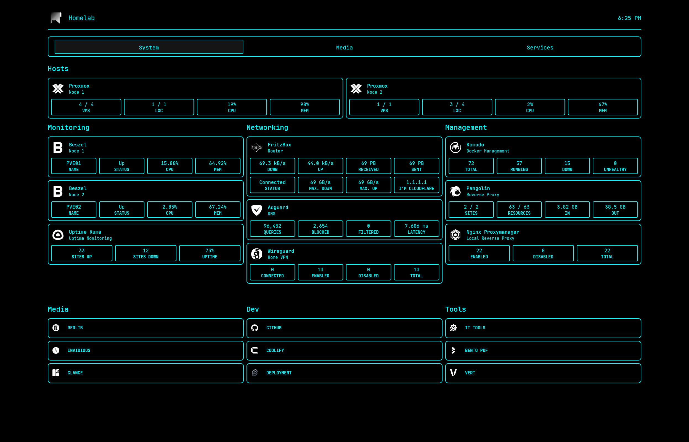

# Homepage Config

My dashboard configuration for [gethomepage/homepage](https://github.com/gethomepage/homepage/). Everything is set up with Docker Compose, environment variables and custom CSS.

## Work In Progress
- [ ] Tdarr, slskd, authentik, vikunja, miniflux, lubelogger
- [ ] custom apis, bookmarks
- [ ] improve env variable naming
- [ ] themed icons
- [ ] clean up custom.css file (catppuccin mocha part)
- [ ] new screenshots
- [ ] (theme switcher?)

*might keep catppuccin mocha as secondary theme inside the custom.css file, theme switcher functionality would be nice...

## Screenshots



## Get Started

### Requirements

- **Docker** and Docker Compose. [Install Docker](https://docs.docker.com/get-docker/)
- Your own environment variables (passwords, api keys, URLs)

### Setup

1. Clone this repository:
   ```bash
   git clone https://github.com/vx06/homepage-config.git
   cd homepage-config
   ```

2. Copy the .env.example to a `.env` file in the appropriate directory. Example:
   ```bash
   cp .env.example .env
   ```

3. Configure the environment variables in the `.env` file.

4. Deploy the homepage container using docker compose:
    ```bash
    docker compose up -d
    ```

5. Access the homepage dashboard at your configured ip:port, example:
    ```
    localhost:20000
    ```

For futher configuration and questions check out the official homepage documentation at [gethomepage.dev](https://gethomepage.dev/)

---

### Environment Variables

Here is a list of some environment variables and their meaning from my configuration:
| Variable                             | Description                            |
|--------------------------------------|----------------------------------------|
| `HOMEPAGE_VAR_SEARCH_URL`            | The Search Engine URL for the Search Bar or Quicklaunch, I use my selfhosted [SearXNG](https://github.com/searxng/searxng) instance. |
| `HOMEPAGE_VAR_SERVICE_HREF`           | The clickable link for the service.      |
| `HOMEPAGE_VAR_SERVICE_URL` | The URL of the service, usually local-ip:port. |
| `HOMEPAGE_VAR_SERVICE_USR`     | Username to access the service.     |
| `HOMEPAGE_VAR_SERVICE_PW`     | Password to access the service.     |
| `HOMEPAGE_VAR_SERVICE_KEY`     | API Key to access the service.      |
| ...                                  | ...                                    |

---

### Custom Theme

My configuration includes a custom CSS theme in [catppuccin mocha style](https://catppuccin.com/palette/).
I no longer use catppuccin mocha as my primary theme, but I plan on keeping it in the custom.css file. Might have to configure theme switching functionality so I can use both my black + cyan theme and my catppuccin mocha theme.

You can customize the `custom.css` file to your liking.

catppuccin mocha wallpapers by [orangci](https://github.com/orangci) can be found [here](https://github.com/orangci/walls-catppuccin-mocha).

## License

This project is licensed under the MIT License. See the [LICENSE](./LICENSE) file for more details. 