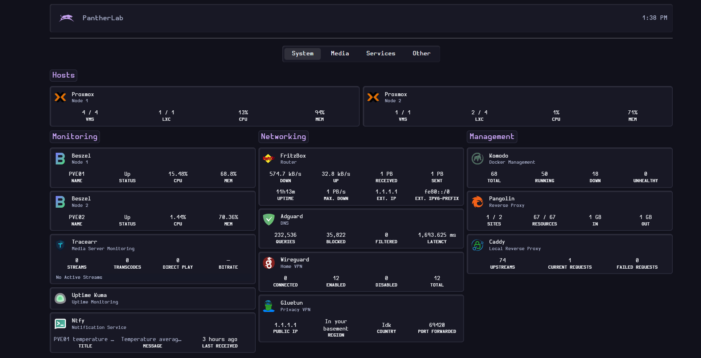

# Homepage Config

My dashboard configuration for [gethomepage/homepage](https://github.com/gethomepage/homepage/). Everything is set up with Docker Compose, environment variables and custom CSS.

## Work In Progress
- [ ] Tdarr, slskd, authentik, miniflux, lubelogger
- [ ] improve env variable naming
- [ ] themed icons
- [ ] maybe go back to old custom css (catpuccin mocha or black-cyan)

Had the idea of implementing a theme switcher to switch between multiple custom themes but never had the time for it. If you want to check the previous themes just check the git history of the custom.css file, current theme was from a reddit user on r/selfhosted, the previous ones were my attempts for some themes.

## Screenshots



## Get Started

### Requirements

- **Docker** and Docker Compose. [Install Docker](https://docs.docker.com/get-docker/)
- Your own environment variables (passwords, api keys, URLs)

### Setup

1. Clone this repository:
   ```bash
   git clone https://github.com/vx06/homepage-config.git
   cd homepage-config
   ```

2. Copy the .env.example to a `.env` file in the appropriate directory. Example:
   ```bash
   cp .env.example .env
   ```

3. Configure the environment variables in the `.env` file.

4. Deploy the homepage container using docker compose:
    ```bash
    docker compose up -d
    ```

5. Access the homepage dashboard at your configured ip:port, example:
    ```
    localhost:20000
    ```

For futher configuration and questions check out the official homepage documentation at [gethomepage.dev](https://gethomepage.dev/)

---

### Environment Variables

Here is a list of some environment variables and their meaning from my configuration:
| Variable                             | Description                            |
|--------------------------------------|----------------------------------------|
| `HOMEPAGE_VAR_SEARCH_URL`            | The Search Engine URL for the Search Bar or Quicklaunch, I use my selfhosted [SearXNG](https://github.com/searxng/searxng) instance. |
| `HOMEPAGE_VAR_SERVICE_HREF`           | The clickable link for the service.      |
| `HOMEPAGE_VAR_SERVICE_URL` | The URL of the service, usually local-ip:port. |
| `HOMEPAGE_VAR_SERVICE_USR`     | Username to access the service.     |
| `HOMEPAGE_VAR_SERVICE_PW`     | Password to access the service.     |
| `HOMEPAGE_VAR_SERVICE_KEY`     | API Key to access the service.      |
| ...                                  | ...                                    |

---

### Custom Theme

currently from a reddit user, previous themes can be found in the git history.

You can customize the `custom.css` file to your liking.

catppuccin mocha wallpapers by [orangci](https://github.com/orangci) can be found [here](https://github.com/orangci/walls-catppuccin-mocha).

## License

This project is licensed under the MIT License. See the [LICENSE](./LICENSE) file for more details. 